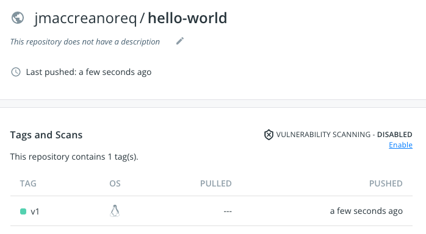
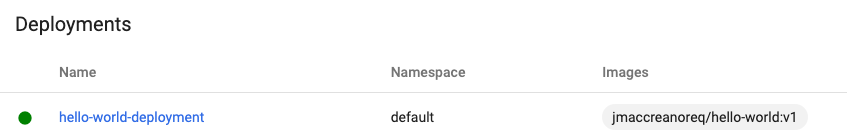
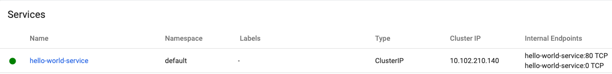
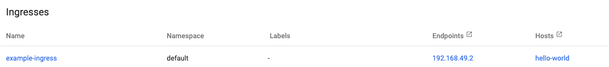
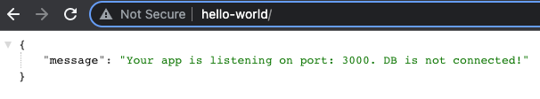
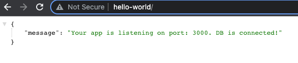

# Hello World with Docker, Minikube and Kubernetes

## Part 1 - Building  and running an app with Docker

### Install
- docker
- node 

### Confirm Application runs from CLI
`npm install` in root application folder to install dependencies <br>
`node | src/app.js` to run app from command line and confirm message shows: 
```
Hello World!
```

### Create a Dockerfile
Next create a Dockerfile which will be used to build the application <br>
This is a series of commands that `docker build` uses to assemble an image <br>
Copy the code below to a new file in the root directory named `Dockerfile`
```
# Choose build image
FROM node:16

# Create directory to hold app
WORKDIR /usr/src/app

# Copy package / package-lock
COPY package.json package-lock.json ./

# Install dependencies
RUN npm install

# Bundle source code inside docker image
COPY . .

# Expose port 3000
EXPOSE 3000

# Define comamnds to run app
CMD ["node", "src/app.js"]
```

### Build Docker Image
Run `docker build -t <app name> .` to build an image from the Docker file <br>
`-t` tags the image with a friendly name <br>
`.` tells `docker build` to look for a Dockerfile in the current directory <br>
Running `docker images` should show the newly created image: <br>
```
REPOSITORY                    TAG                 IMAGE ID       CREATED              SIZE
hello-world                   latest              3dca8a332016   About a minute ago   914MB
```

### Run as a Container
`docker run -p 3000:3000 --name=<container name> <app name>` <br>
This maps the container port 3000 to port 3000 on your machine, going to `http://localhost:3000` should show the app running in the browser <br>
And if we open Docker Desktop, we should see the running container: 


### Docker Compose
For local development it is common to use Docker Compose rather than building and running Dockerfiles locally <br>
Stop the current container with `docker stop <container name>` <br>
Copy the code below to a file called `docker-compose.yml` in the root directory
```
version: "3.7"

# Define services
services:

  # Application
  app:

     # Build step - looks for Dockerfile
     build: .

     # Port mapping
     ports:
       - "3000:3000"
```
And run with `docker compose build && docker compose up`, again the app should be available in the browser on `http://localhost:3000` and visible in Docker Desktop <br>
Stop the app with `docker compose down`

### Push Image
In order to deploy, the image needs to be pushed to a repository <br>
If you do not have an existing docker hub login create one here https://hub.docker.com/ <br>
Login to docker from the command line with `docker login -u <username> -p <password>` <br>
Tag the image with a version and your username `docker tag <app name> <username>/<app name>:v1` <br>
Push image `docker push <username>/<app name>:v1` <br>
Now go to https://hub.docker.com/repositories, and should be able to see your newly pushed repository: 



## Part 2  - Running on Kubernetes

### Install
- minikube
- kubectl

### Minikube Cluster
Create a local cluster for the app to run on with `minikube start` <br>
Once minikube starts, running `minikube dashboard` will open a Kubernetes dashboard where we can view any kubernetes resources that have been created <br>
Verify you are operating within the minikube context by running `kubectl config current-context` <br>
If the output is something other than `minikube`, run `kubectl config set-context minikube`

### Create Deployment
In the k8s folder, rename `deployment.yml.temp` to `deployment.yml` and replace the comments with values <br>
Run `kubectl apply -f k8s` to create a deployment with the desired number of pods. After a few seconds the deployment should be visible in the kubernetes dashboard



This can also be viewed from the command line by running `kubectl get deloyments` <br>
And the pods can be viewed by running `kubectl get pods` <br>
We can verify the app is running in these pods with `kubectl logs <name of pod>` which should print the `Hello World!` message

### Create Service
In the previous step we verified the app was running by checking the logs, in order to actually access the application we need to expose the pods via a service <br>
Rename `service.temp.yml` to `service.yml` and replace the comments with values <br>
Run `kubectl apply -f service.yml` to create the service <br>




Once created it should appear in the dashboard <br>
Copy a pod name from the output of `kubectl get pods` <br>
Run `kubectl exec --stdin --tty <pod name> -- /bin/bash` to launch a bash session inside the pod <br>
Now you can hit the service from inside the pod with `curl <cluster ip>` which should return some json: 

```
root@hello-world-deployment-6bbc76b598-2zhj5:/usr/src/app# curl 10.102.210.140
{"message":"Your app is listening on port: 3000. DB is not connected!"}
```

Exit the pod by typing `exit` <br>
So far the application can be accessed by logging into a pod inside the cluster, however we need to provide external access to users <br>


### Create Ingress
An ingress allows external access to a cluster <br>
To enable this with minikube in a new terminal window run `minikube addons enable ingress` and then `minikube tunnel` to create a network route from the host to the service <br>
Rename `ingress.temp.yml` to `ingress.yml` and replace the comments with values <br>
Apply the ingress file to create it, you should now be able to access the app via the browser on `127.0.0.1` <br>



Optionally, to access the application on the specified ingress host, we can point our mac's local ip address to the host <br>
In a terminal window run `sudo nano /etc/hosts` and add the following lines to the file: 

```
# hello world host
127.0.0.1 <your host name>
```

Now our application should also be accessible by going to the hostname in the browser



## Part 3 - Adding a MySQL DB connection locally
To create a database connection in our application we can use docker compose to start a container running a MySQL image <br>
Update `docker-compose.yml` so it matches the code below:
```
# For local development
version: "3.7"

# Define services
services:

  # Application
  app:

    # Build step - looks for Dockerfile
    build: .

    # Port mapping
    ports:
      - "3000:3000"

    # Start the DB before running the app
    depends_on:
      - mysql

    # Vars
    environment:
      DB_PASSWORD: password
      DB_USERNAME: root
      DB_PORT: 3306
      DB_HOST: mysql

  # Database
  mysql:

    # MySQL image
    image: mysql:5.7

    # DB port mapping
    ports:
      - "3306:3306"
      
    # Vars
    environment:
      MYSQL_ROOT_PASSWORD: password

      # Where our data will be persisted
    volumes:
      - mysql-volume:/var/lib/mysql

# Name our volume
volumes:
  mysql-volume:

```

Uncomment the DB connection code in `src/app.js` and run `docker compose build && docker compose up` <br>
The following should be printed to the conosle: 
```
| Hello World!
| DB Connected!
```
## Part 4 - Running MySQL on Kubernetes
Similarly to what we did with our application, we can run a MySQL image on kubernetes that we can connect our app to <br>

###Create MySQL manifest
Rename `mysql.yml.temp` to `mysql.yml` and fill in the commented values <br>
This yml file creates a service, StatefulSet running a MySQL image, and a persistent volume claim which provisions storage that persists independently to the lifecycle of pods<br>
Apply the mysql manifest with `kubectl apply -f mysql.yml`<br>
We should get confirmation of these created resources in the console, and they should now be visible on the dashboard
```
service/hello-world-mysql-service created
statefulset.apps/hello-world-mysql created
persistentvolumeclaim/mysql-pv-claim created
```

###Create Config Map
Use a ConfigMap to store non-confidential DB creds that our app will use to connect to the DB <br>
Rename `db-configmap.yml.temp` to `db-configmap.yml` and replace the commented values <br>
Apply the file with kubectl <br>

### Create MySQL Secret 
Use secrets to store confidential creds <br>
Rename `mysql-secret.yml.temp` to `mysql-secret.yml`<br>
Apply the secret the with kubectl 


##Part 5 - Updating app image and redeploy
Finally, we need to update our application image with the DB connection code that was uncommented in `app.js` and redeploy <br>

### Update hello-world Image
Run `docker build -t <username>/<image name>:<version> . ` to rebuild and tag the image with a new version
Push the image `docker push <username>/<image name>:<version>`

### Update Deployment
Update the version of your image in the deployment<br>
Add the DB creds as environment variables to the app container file so they can be used to create the DB connection<br>
Your final deployment should look something like this: 
```
apiVersion: apps/v1
kind: Deployment
metadata:
  name: hello-world-deployment
spec:
  selector:
    matchLabels:
      app: hello-world
  replicas: 3
  template:
    metadata:
      labels:
        app: hello-world
    spec:
      containers:
        - name: hello-world-container
          image: jmaccreanoreq/hello-world:v2
          ports:
          - containerPort: 3000
          envFrom:
            - configMapRef:
                name: hello-world-config-map
          env:
            - name: DB_PASSWORD
              valueFrom:
                secretKeyRef:
                  name: mysql-secret
                  key: password
```
Apply the deployment file with kubectl <br>
Restart the deployment so the pods take the updated image `kubectl rollout restart deployment <deployment name>`<br>
Going to the hostname in the browser should now show that there is a DB connected!


